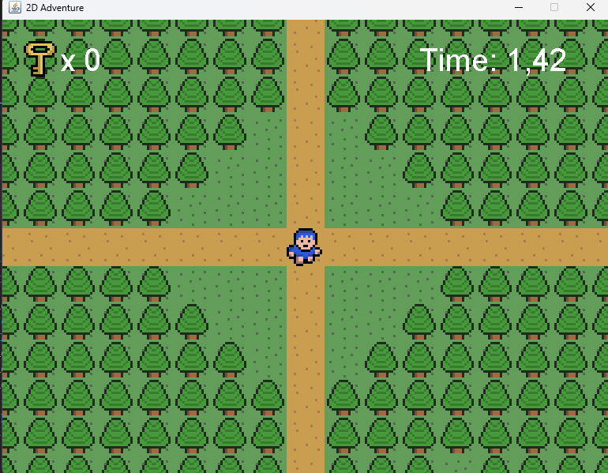
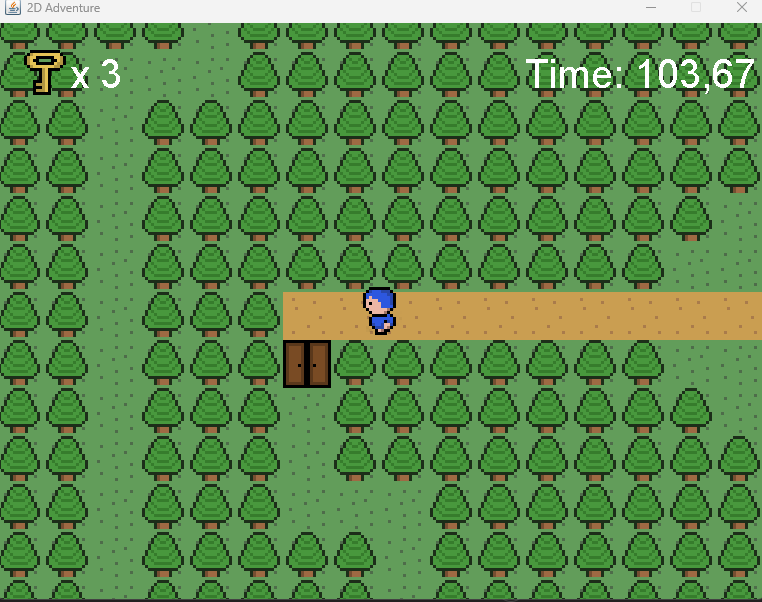
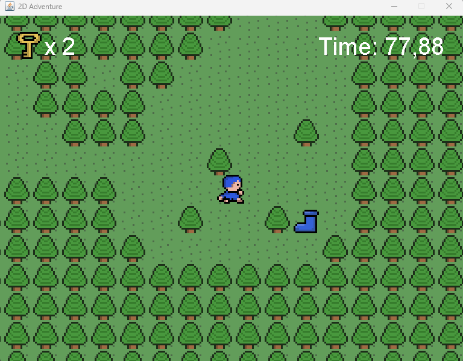
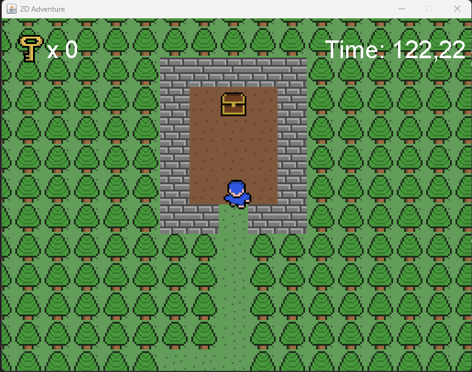
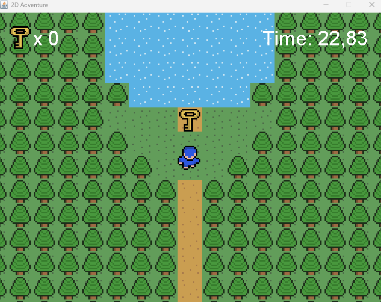
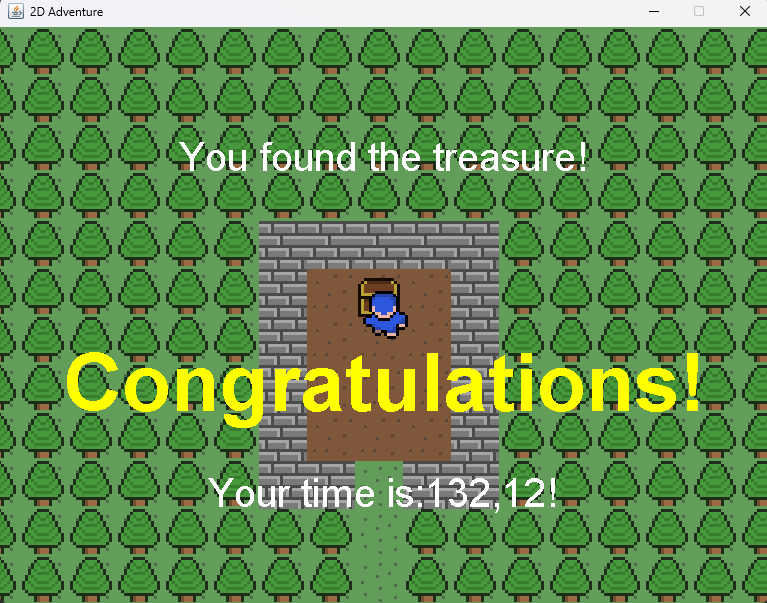
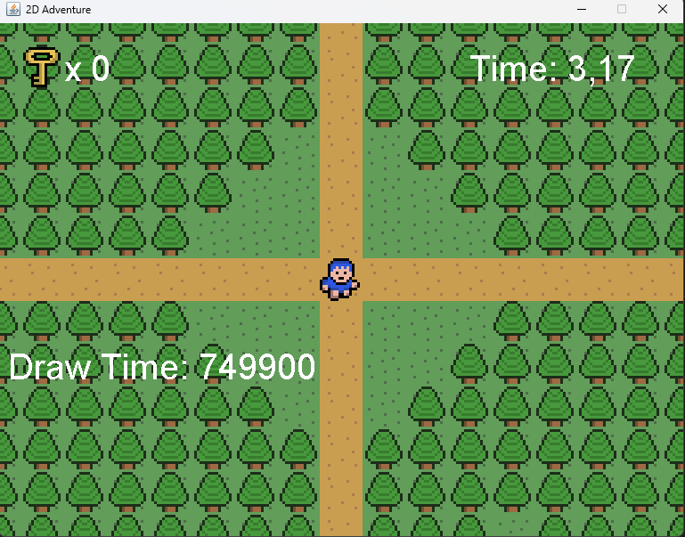

# 🗺️ 2D Adventure RPG — **Java Edition**

## 🌟 Visão & Objetivos



A proposta deste projeto é **materializar um engine 2D completo em Java puro**, unindo práticas de engenharia de software a técnicas clássicas de game‑design. Durante o desenvolvimento foram explorados, em profundidade:

- **POO avançada** — modelagem de entidades, herança e polimorfismo aplicados a objetos de jogo.
- **Arquitetura de game engines** — *game loop* de passo fixo, gerenciamento de cena e culling.
- **Matemática & física** — colisão AABB, transformação de coordenadas e lógica vetorial básica.
- **Gestão de recursos** — pipeline de sprites, áudio PCM e mapas em texto.

Todo o projeto foi desenvolvido acompanhando a playlist do RyiSnow, seguindo fielmente o conteúdo proposto pelo autor como forma de aprendizado prático.

---

## 🧱 Estrutura do Código

```text
📂 Projeto_Game_2d_JAVA
├─ entity/         # Entidades móveis (Player e superclasse Entity)
│  ├─ Entity.java
│  └─ Player.java
├─ main/           # Engine central, entrada, utilitários e áudio
│  ├─ AssetSetter.java
│  ├─ CollisionChecker.java
│  ├─ GamePanel.java
│  ├─ KeyHandler.java
│  ├─ Main.java
│  ├─ Sound.java
│  ├─ UI.java
│  └─ UtilityTool.java
├─ object/         # Objetos coletáveis/interativos
│  ├─ OBJ_Boots.java
│  ├─ OBJ_Chest.java
│  ├─ OBJ_Door.java
│  ├─ OBJ_Key.java
│  └─ SuperObject.java
├─ tile/           # Definição de tile e gerência de mapa
│  ├─ Tile.java
│  └─ TileManager.java
├─ res/            # Recursos externos
│  ├─ maps/        # Mapas .txt com layout numérico
│  ├─ objects/     # Sprites de itens
│  ├─ player/      # Frames de animação do jogador
│  ├─ sound/       # WAVs (BGM & SFX)
│  └─ tiles/       # Sprite-sheet dos tiles
```

---




## ✨ Funcionalidades Já Implementadas

- 🎮 Movimentação 4 direções com animação fluida
- 🔑 Sistema de chaves & portas trancadas
- 👟 Power‑up de velocidade (Boots)
- 🗝️ Baú que encerra o jogo com fanfarra
- 🖥️ HUD: cronômetro + contador de chaves
- 🔊 Música de fundo + efeitos sonoros

---







## 📚 Fundamentos Teóricos (Deep-Dive)

### 1. Programação Orientada a Objetos

- **Abstração** — entidades encapsulam estado e comportamento.
- **Encapsulamento** — campos privados com acesso controlado.
- **Herança** — `Player` ← `Entity`, `OBJ_Key` ← `SuperObject`.
- **Polimorfismo** — coleções genéricas tratam múltiplos subtipos.

### 2. Arquitetura de Jogo-2D

- **Game Loop** fixo (60 FPS) — `update()` → `draw()`.
- **Mapa** em **.txt** → matriz `int[][]` → sprite-sheet escalado.
- **Câmera** — posição relativa (mundo → tela) para mapas extensos.
- **Culling** — render só do que está no viewport para alta performance.

### 3. Matemática & Física

- Conversão mundo/tela suave.
- Colisão **AABB** em `CollisionChecker`.
- Vetorização pensada para futuras mecânicas (knockback etc.).

### 4. Gestão de Recursos

- Carregamento preguiçoso de imagens.
- Escalonamento de sprites (`UtilityTool.scaleImage`).
- Sons bufferizados para latência zero.

### 5. SOLID & Clean Code

- **SRP** em cada pacote; métodos concisos e comentários explicativos.

---

## 🧩 Design Patterns Aplicados

| Padrão                | Onde                                      |
| --------------------- | ----------------------------------------- |
| **Game Loop**         | `GamePanel` (thread dedicada)             |
| **Factory/Spawner**   | `AssetSetter` cria objetos via ID de mapa |
| **Observer**          | `KeyHandler` → eventos Swing              |
| **Singleton (sound)** | Controle global de mixagem e volume       |

---



## 🔍 Principais Classes

| Classe                     | Responsabilidade                              |
| -------------------------- | --------------------------------------------- |
| `Main`                     | Cria a janela (`JFrame`) e injeta `GamePanel` |
| `GamePanel`                | Loop, atualização, desenho, controle de FPS   |
| `KeyHandler`               | Buffer de teclas (WASD, Enter)                |
| `TileManager`              | Lê `.txt`, converte IDs em sprites            |
| `CollisionChecker`         | AABB: jogador x objetos/tiles                 |
| `Entity` & `Player`        | Movimento + animação + inventário             |
| `SuperObject` & subclasses | Itens: chave, porta, baú, botas               |
| `UI`                       | HUD: tempo, mensagens contextuais             |

---

## 🙌 Créditos

- Curso base: **RyiSnow** — YouTube
- Sprites & SFX: **Kenney.nl**, **OpenGameArt**
- Código: **Miguel de Castilho Gengo** — Eng. Computação @ PUC-Campinas

---

## 📜 Licença

Distribuído sob **MIT License** — consulte [`LICENSE`](LICENSE).

> *Feel free to open issues, forks and pull requests!*
